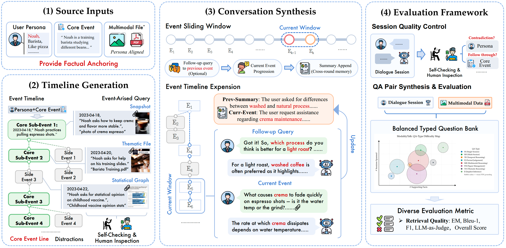

<h1 align="center"> 💫 M<sup>3</sup>Exam: Benchmarking Multimodal Memory for Realistic User-Agent Interactions </a></h2>


<h5 align="center"> If you like our project, please give us a star ⭐ on GitHub for the latest update.</h5>

<h5 align="center">



</h5>

This is the official project repository for **M<sup>3</sup>Exam: Benchmarking Multimodal Memory for Realistic
User-Agent Interactions**.

## 📦 Dataset: M<sup>3</sup>Exam

M<sup>3</sup>Exam is a novel query-centric multimodal conversational QA benchmark built on realistic user-agent interactions, enabling balanced multi-dimensional evaluation across multimodal memorizing, cross-modal reasoning, and implicit-intent interpreting over long-horizon histories of dialogue, images, and documents. We further propose **M<sup>3</sup>Proctor**, a modality-aware multimodal memory method that detects query modality bias and escalates to raw visual sources only on demand through a cost-aware cascade, enabling efficient multimodal evidence management with selective rather than indiscriminate visual injection.

A ready-to-inspect example persona lives under [example_set/](example_set/). Each persona directory has the following layout:

```
<Persona_Name>/
├── sessions.json                 # multi-session dialogue history (the memory)
├── question.json                 # annotated questions over the history
├── timeline_<Persona_Name>.json  # the core-event timeline anchoring generation
├── images/                       # images shared in the dialogue (img_<n>.jpg/png)
└── pdfs/                         # PDF documents shared in the dialogue
```

## 🧠 Method: M<sup>3</sup>Proctor

M<sup>3</sup>Proctor is our modality-aware memory method, packaged under [m3proctor/](m3proctor/). Built on a naive-RAG backbone, it adds round-level chunking, session-summary chunks, PDF text-layer extraction, VLM captions for images, a query-side modality classifier, and modality-aware re-ranking, followed by a two-stage cascade answerer that escalates to images / rendered PDF pages **only when the text-only answer is not confident enough**.

```bash
# Quickstart
python -m m3exam.m3proctor.run --dataset Noah_BaristaApprentice
```


## 🚀 Get Started

This section walks through running the benchmark on the released dataset. For details on how the dataset itself was generated, see the docstrings under [execution/](execution/).

**1. Configure** API endpoints, dataset paths, and the LLM-judge model in [config/config.yaml](config/config.yaml) (top-level run) and/or [baselines/config.yaml](baselines/config.yaml) (when running baselines).

**2. Set up baselines.** Third-party memory methods (A-Mem, MemoryOS, MIRIX, MemVerse, NGM, RAG-Anything, UniversalRAG) are *not* bundled in this repo. Fetch their source code on demand with the setup script:

```bash
# Install every baseline's upstream into baselines/<name>/upstream/
bash baselines/scripts/setup_upstream.sh

# Or only the ones you plan to run
bash baselines/scripts/setup_upstream.sh amem mirix

# See what's available
bash baselines/scripts/setup_upstream.sh --list
```

The script clones each upstream's default branch (no version pinning). `mem0` and `nano_graphrag` are pip-installable and need no clone — see [baselines/README.md](baselines/README.md) for the matching `pip install` commands and per-baseline extras. We have incorporated several baseline methods and benchmark datasets:

| Baseline | Paper | Code |
| -------- | ----- | ---- |
| NaiveRAG | [Retrieval-Augmented Generation for Knowledge-Intensive NLP Tasks](https://arxiv.org/abs/2005.11401) | [nano-graphrag](https://github.com/gusye1234/nano-graphrag) |
| A-Mem | [A-MEM: Agentic Memory for LLM Agents](https://arxiv.org/abs/2502.12110) | [A-Mem](https://github.com/WujiangXu/A-mem) |
| Mem0  | [Mem0: Building Production-Ready AI Agents with Scalable Long-Term Memory](https://arxiv.org/abs/2504.19413) | [Mem0](https://github.com/mem0ai/mem0) |
| MemoryOS | [Memory OS of AI Agent](https://aclanthology.org/2025.emnlp-main.1318.pdf) | [MemoryOS](https://github.com/BAI-LAB/MemoryOS) |
| UniversalRAG | [UniversalRAG: Retrieval-Augmented Generation over Corpora of Diverse Modalities and Granularities](https://arxiv.org/abs/2504.20734) | [UniversalRAG](https://github.com/wgcyeo/UniversalRAG) |
| RAG-Anything | [RAG-Anything: All-in-One RAG Framework](https://arxiv.org/abs/2510.12323) | [RAG-Anything](https://github.com/HKUDS/RAG-Anything) |
| MIRIX | [MIRIX: Multi-Agent Memory System for LLM-Based Agents](https://arxiv.org/abs/2507.07957) | [MIRIX](https://github.com/Mirix-AI/MIRIX) |
| MemVerse | [MemVerse: Multimodal Memory for Lifelong Learning Agents](https://arxiv.org/abs/2512.03627) | [MemVerse](https://github.com/KnowledgeXLab/MemVerse) |
| NGM (Neural Graph Memory) | [Neural Graph Memory: A Structured Approach to Long-Term Memory in Multimodal Agents](https://www.researchgate.net/profile/Matt-Fisher-7/publication/394440420_Neural_Graph_Memory_A_Structured_Approach_to_Long-Term_Memory_in_Multimodal_Agents/links/689ab8c337b271210509c20f/Neural-Graph-Memory-A-Structured-Approach-to-Long-Term-Memory-in-Multimodal-Agents.pdf) | [Neural-Graph-Memory-NGM](https://github.com/StuckInTheNet/Neural-Graph-Memory-NGM) |


**3. Run a baseline** through the unified entry point:

```bash
python -m m3exam.baselines.run --baseline mirix --dataset Noah_BaristaApprentice
```

Available baselines: `a_mem`, `memoryos`, `mem0_text`, `mem0_visual`, `nano_graphrag`, `mirix`, `memverse`, `ngm`, `raganything`, `universalrag`.

**4. Run our proposed method** M<sup>3</sup>Proctor on the same dataset:

```bash
python -m m3exam.m3proctor.run --dataset Noah_BaristaApprentice
```

Each run writes `results.json` + `summary.json` + a printed per-type rubric. See [baselines/README.md](baselines/README.md) and [m3proctor/README.md](m3proctor/README.md) for the full set of flags and output details.

### Evaluation Metrics

Metrics are reported per question type and aggregated: **EM**, **F1**, **BLEU-1**, and a five-point **LLM-judge** (0 / 0.25 / 0.5 / 0.75 / 1).

## 📂 Project Structure

```
m3exam/
├── config/                 # unified YAML config + loader
├── execution/              # CLI entry points for each pipeline stage
│   ├── run_timeline.py     # core-event timeline generation
│   ├── run_questions.py    # question generation (8 types)
│   ├── run_finalize.py     # finalize persona into released layout
│   └── run_evaluation.py   # model / baseline evaluation
├── functions/              # pipeline implementations
│   ├── common/             # shared LLM / vision / JSON utilities
│   ├── timeline/           # timeline generation
│   ├── question_generation/# typed question generators
│   ├── thematic/           # thematic-subset construction
│   ├── finalize/           # dataset finalization
│   └── evaluation/         # scoring + multimodal-dependency analysis
├── m3proctor/              # M3Proctor multimodal memory method
├── example_set/            # one ready-to-inspect example persona
└── figures/                # paper figures
```

## 📄 License

This project is released under the [Apache License 2.0](LICENSE).